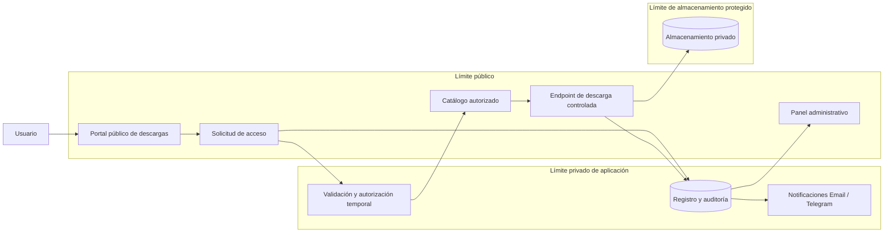

# DCP DownloadGate

🌐 **Idiomas:** [English](README.md) · Español

## 1. Resumen ejecutivo

DCP DownloadGate es una solución autohospedada para distribuir archivos de forma controlada, pensada para organizaciones que necesitan entregar instaladores, documentos o activos digitales privados sin exponer su ubicación física mediante enlaces públicos permanentes.

La arquitectura implementada separa la experiencia pública de solicitud, la lógica privada de la aplicación y el almacenamiento protegido de archivos. El usuario solicita acceso, recibe una autorización temporal y descarga el activo seleccionado mediante un endpoint controlado. Las solicitudes y la actividad de descarga quedan registradas para seguimiento operativo.

**Nivel de evidencia:** desplegada para un caso real de distribución de software empresarial. El caso público está sanitizado y no expone credenciales del cliente, código fuente privado, secretos productivos ni información operativa confidencial.

## 2. Contexto

Un proveedor de software necesitaba distribuir múltiples instaladores para Windows desde su propio hosting. El modelo operativo anterior podía exponer enlaces directos a archivos, ofrecía poca visibilidad sobre quién solicitaba cada instalador y dificultaba mantener un catálogo consistente.

La solución debía funcionar en un hosting PHP convencional y, al mismo tiempo, incorporar controles útiles sobre acceso, almacenamiento y trazabilidad.

## 3. Problema

El problema de negocio no era solamente alojar archivos. Era distribuirlos de manera controlada sin complicar innecesariamente la operación.

La solución debía responder cuatro preguntas:

1. ¿Cómo permitir solicitudes sin entregar una URL pública permanente?
2. ¿Cómo mantener los instaladores fuera del acceso web directo?
3. ¿Cómo revisar solicitudes y actividad de descarga?
4. ¿Cómo reemplazar instaladores sin reconstruir el portal?

## 4. Restricciones

- Hosting PHP compartido o administrado ya existente.
- Sin necesidad de una gran plataforma cloud ni orquestación de contenedores.
- Los instaladores debían permanecer fuera del directorio web público.
- El cliente necesitaba un área administrativa independiente.
- La solución debía soportar múltiples productos y reemplazos futuros de archivos.
- Credenciales, tokens y valores específicos de producción no podían quedar dentro de la base reutilizable.
- La simplicidad operativa era más importante que introducir una arquitectura distribuida compleja.

## 5. Drivers arquitectónicos

- **Seguridad:** evitar exposición directa de los archivos descargables.
- **Auditabilidad:** conservar registros de solicitudes y descargas.
- **Simplicidad de despliegue:** operar sobre un stack PHP convencional.
- **Mantenibilidad:** reemplazar o agregar archivos con poco esfuerzo operativo.
- **Separación de responsabilidades:** mantener distintas la capa pública, la lógica privada y el almacenamiento protegido.
- **Reutilización:** conservar una base limpia adaptable a futuros clientes.
- **Control de costos:** aprovechar el hosting existente sin infraestructura innecesaria.

## 6. Límites del sistema

### Dentro de la solución

- catálogo público de productos;
- formulario de solicitud de acceso;
- generación y validación de acceso temporal;
- entrega controlada de archivos;
- panel administrativo;
- persistencia de solicitudes y descargas;
- notificaciones por correo y Telegram;
- configuración de productos y relación con archivos privados.

### Responsabilidades externas

- cuenta de hosting y permisos del servidor;
- infraestructura de entrega de correo;
- credenciales del bot de Telegram cuando se habilita;
- validación antivirus e integridad de instaladores cargados;
- aprobación empresarial de nombres, versiones y publicaciones.

## 7. Vista general de arquitectura

El límite de confianza principal está entre la aplicación web pública y el almacenamiento protegido. El usuario nunca recibe la ruta física del servidor. El archivo se transmite únicamente después de validar la autorización temporal, el producto solicitado y los límites de acceso.

## 8. Decisiones clave

### Decisión 1 — Mantener los archivos fuera del directorio web público

**Por qué:** una carpeta pública o una URL permanente permitiría compartir el enlace sin control y omitiría el registro de solicitud.

**Alternativa considerada:** enlaces estáticos protegidos solo por nombres poco evidentes.

**Trade-off:** la administración de archivos requiere acceso al hosting o SFTP, en lugar de una biblioteca pública de medios.

**Costo de reversión:** bajo a medio. Es posible migrar a object storage más adelante si se conserva el contrato de entrega.

### Decisión 2 — Usar accesos temporales emitidos por la aplicación

**Por qué:** crea una ventana controlada de entrega sin obligar a cada usuario a mantener una cuenta.

**Alternativa considerada:** cuentas completas de cliente con contraseña.

**Trade-off:** el acceso temporal es más simple, pero ofrece menor certeza de identidad que una cuenta autenticada.

**Costo de reversión:** medio. Se puede incorporar autorización basada en cuentas sin abandonar el almacenamiento protegido.

### Decisión 3 — Usar SQLite en el despliegue inicial

**Por qué:** la escala operativa esperada no justificaba un servicio de base de datos separado. SQLite simplificó despliegue, respaldo y administración en el hosting existente.

**Alternativa considerada:** MySQL o PostgreSQL.

**Trade-off:** SQLite funciona bien con concurrencia moderada, pero debe reevaluarse si aumenta significativamente el tráfico o se adopta despliegue multinodo.

**Costo de reversión:** medio porque la persistencia está aislada detrás de servicios de aplicación y puede migrarse mediante un plan explícito.

### Decisión 4 — Mantener un catálogo de productos dirigido por configuración

**Por qué:** los productos, metadatos visibles y nombres de archivos privados pueden mantenerse sin rediseñar el portal.

**Alternativa considerada:** tarjetas de producto codificadas manualmente en varias páginas.

**Trade-off:** el operador debe mantener sincronizados el registro del catálogo y el nombre físico del archivo.

**Costo de reversión:** bajo. El catálogo podría migrar posteriormente a una interfaz administrativa basada en base de datos.

### Decisión 5 — Mantener los valores productivos fuera de la base reutilizable

**Por qué:** la implementación debía convertirse en un activo reutilizable de DCP sin exponer correos, teléfonos, tokens, credenciales ni archivos privados.

**Alternativa considerada:** copiar la instalación productiva directamente al control de versiones.

**Trade-off:** cada despliegue requiere pasos locales de configuración.

**Costo de reversión:** no aplica intencionalmente; los secretos deben permanecer fuera del código fuente.

## 9. Seguridad y privacidad

El modelo de seguridad se basa en reducir por capas la exposición directa, sin presentarse como una solución DRM absoluta.

Controles aplicados:

- archivos almacenados fuera del directorio web público;
- ausencia de URL directa publicada al usuario;
- tokens de acceso con vigencia limitada;
- límites configurables de descarga;
- validación de identificadores de producto y rutas resueltas;
- administración separada del flujo público;
- registros de solicitudes, intentos y descargas;
- secretos productivos almacenados en archivos locales ignorados por Git;
- exclusión de logs, bases de datos, exportaciones y binarios del repositorio;
- guía de nombres y permisos para operadores;
- recomendación de antivirus y checksum antes de publicar instaladores.

La solución no impide que un usuario autorizado copie un archivo después de descargarlo. Su objetivo es la entrega controlada, no el DRM del dispositivo final.

## 10. Entrega y operación

El modelo operativo desplegado es intencionalmente simple:

1. un operador carga o reemplaza un instalador en el almacenamiento protegido;
2. el catálogo se actualiza solo cuando cambia el nombre físico del archivo;
3. se verifican permisos e integridad;
4. se prueba una descarga completa desde el portal público;
5. la versión anterior se archiva o elimina después de validar;
6. los administradores revisan solicitudes y exportan actividad cuando lo necesitan.

La documentación separa la guía entregada al cliente del repositorio privado reutilizable. El cliente recibe instrucciones del portal y administración; DCP conserva la base de ingeniería sanitizada.

## 11. Desarrollo asistido por IA

Las herramientas de IA apoyaron la estructuración documental, la revisión del repositorio, los checklist de sanitización y la preparación de una infografía. La revisión humana mantuvo la responsabilidad de:

- validar el flujo real de producción;
- decidir qué archivos y valores eran confidenciales;
- confirmar la estructura del repositorio;
- aprobar las instrucciones operativas;
- revisar y fusionar cambios;
- definir el cierre del proyecto.

Ningún sistema de IA aprobó de forma autónoma accesos productivos, credenciales ni cambios de despliegue.

## 12. Evidencia y validación

| Afirmación | Nivel de evidencia |
|---|---|
| Catálogo público y flujo de solicitud | Desplegado |
| Acceso temporal controlado | Desplegado |
| Archivos privados fuera del acceso web directo | Desplegado |
| Administración y revisión de auditoría | Desplegado |
| Exportación CSV | Desplegado |
| Notificaciones por correo y Telegram | Desplegadas y revisadas operativamente |
| Base reutilizable sanitizada | Completada en repositorio privado |
| Escalabilidad de alto volumen o multinodo | No validada |

La arquitectura no debe interpretarse como evidencia de rendimiento a gran escala. La implementación fue validada para su contexto real de hosting empresarial.

## 13. Resultados

El proyecto entregó:

- portal centralizado de descargas;
- estructura protegida para instaladores;
- accesos temporales en lugar de enlaces permanentes;
- trazabilidad de solicitudes y descargas;
- interfaz administrativa;
- operación documentada de reemplazo de archivos;
- base de producto reutilizable y sanitizada.

No se publican métricas de conversión, seguridad o rendimiento que no estén respaldadas por evidencia.

## 14. Aprendizajes

1. La distribución de archivos es un problema de control de acceso y operación, no solo de almacenamiento.
2. Mantener binarios fuera del web root crea un límite más fuerte que confiar en URLs poco visibles.
3. Un hosting sencillo puede soportar controles útiles cuando las responsabilidades están bien separadas.
4. La documentación para el cliente debe centrarse en uso y valor; la documentación de ingeniería debe permanecer interna.
5. La sanitización debe considerar tanto los archivos actuales como el riesgo del historial de versiones.
6. Una base reutilizable debe consolidarse después de comprender y preservar el comportamiento productivo.
7. Evitar refactorizaciones innecesarias durante la estabilización reduce el riesgo de entrega.

## 15. Próximas preguntas arquitectónicas

La arquitectura evolucionaría ante:

- aumento importante de tráfico concurrente;
- archivos muy grandes o presión de costos de ancho de banda;
- aislamiento multi-tenant;
- cuentas y permisos por cliente;
- object storage y URLs firmadas;
- flujos de aprobación de releases;
- verificación automática de checksums;
- integración con CRM, licenciamiento o portales de clientes;
- mayores requisitos de cumplimiento o retención.

Mientras esas condiciones no existan, la arquitectura prioriza simplicidad controlada sobre complejidad prematura.

## Estado de publicación

**Estado:** caso de estudio publicado.  
**Evidencia de implementación:** desplegada para un caso real de negocio.  
**Sanitización:** identidad del cliente, secretos de producción, datos personales, código propietario y detalles del repositorio privado excluidos.
