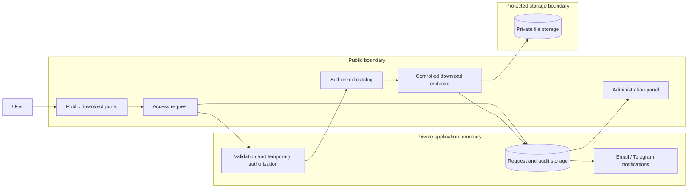

# DCP DownloadGate

🌐 **Languages:** English · [Español](README.es.md)

## 1. Executive summary

DCP DownloadGate is a self-hosted controlled file distribution solution designed for organizations that need to deliver installers, documents or private digital assets without exposing their physical storage location through permanent public links.

The implemented architecture separates the public request experience, private application logic and protected file storage. Users request access, receive a time-limited authorization and download the selected asset through a controlled delivery endpoint. Requests and download activity are recorded for operational follow-up.

**Evidence level:** deployed for a business software distribution use case. The public case is sanitized and does not expose client credentials, private source code, production secrets or confidential operational data.

## 2. Context

A software vendor needed to distribute multiple Windows installers from its own hosting. The previous operational model risked direct exposure of file URLs, provided limited visibility over who requested each installer and made it harder to maintain a consistent download catalog.

The solution had to remain simple enough for conventional PHP hosting while adding meaningful controls around access, storage and traceability.

## 3. Problem

The business problem was not merely hosting files. It was enabling controlled distribution while preserving a straightforward operating model.

The solution needed to answer four questions:

1. How can users request files without receiving a permanent public URL?
2. How can installers remain outside direct web access?
3. How can the business review requests and download activity?
4. How can operators replace installers without rebuilding the portal?

## 4. Constraints

- Existing shared or managed PHP hosting.
- No requirement for a large cloud platform or container orchestration.
- Installers must remain outside the public web directory.
- The client needed an independent administration area.
- The solution had to support multiple products and future file replacements.
- Production credentials, tokens and client-specific values could not become part of the reusable source baseline.
- Operational simplicity was more important than introducing a complex distributed architecture.

## 5. Architectural drivers

- **Security:** avoid direct exposure of downloadable assets.
- **Auditability:** retain request and download records.
- **Deployment simplicity:** operate on a conventional PHP stack.
- **Maintainability:** replace or add files with limited operational effort.
- **Separation of concerns:** keep public pages, private logic and protected storage distinct.
- **Reusability:** preserve a clean baseline that can be adapted for future clients.
- **Cost control:** use the existing hosting environment without unnecessary infrastructure.

## 6. System boundaries

### Inside the solution

- public product catalog;
- access request form;
- temporary access generation and validation;
- controlled file delivery;
- administration panel;
- request and download persistence;
- email and Telegram notifications;
- product configuration and private file mapping.

### External responsibilities

- hosting account and server permissions;
- email delivery infrastructure;
- Telegram bot credentials when enabled;
- antivirus and integrity validation of uploaded installers;
- business ownership of product names, versions and release approval.

## 7. Architecture overview

The important trust boundary is between the public web application and protected file storage. The user never receives the physical server path. A download is streamed only after the temporary authorization, requested product and access limits are validated.

## 8. Key decisions

### Decision 1 — Keep files outside the public web directory

**Why:** A public folder or permanent URL would allow uncontrolled sharing and bypass request tracking.

**Alternative considered:** Static links protected only by obscure filenames.

**Trade-off:** File management requires hosting or SFTP access rather than a generic media library.

**Reversal cost:** Low to medium. Moving to object storage later is possible if the delivery contract remains stable.

### Decision 2 — Use temporary application-issued access

**Why:** It creates a controlled window for delivery without requiring every end user to maintain an account.

**Alternative considered:** Full customer accounts with passwords.

**Trade-off:** Temporary access is simpler but provides less identity assurance than authenticated customer accounts.

**Reversal cost:** Medium. Account-based authorization could be introduced later without changing protected storage principles.

### Decision 3 — Use SQLite for the initial deployment

**Why:** The expected operational scale did not justify a separate database service. SQLite simplified deployment, backup and administration on the existing hosting.

**Alternative considered:** MySQL or PostgreSQL.

**Trade-off:** SQLite is appropriate for modest write concurrency but would need reassessment under significantly higher traffic or multi-node deployment.

**Reversal cost:** Medium because persistence is isolated behind application services and can be migrated with an explicit data plan.

### Decision 4 — Maintain a configuration-driven product catalog

**Why:** Products, display metadata and private filenames can be maintained without redesigning the public portal.

**Alternative considered:** Hard-coded product cards across multiple pages.

**Trade-off:** Operators must keep the catalog entry and physical filename synchronized.

**Reversal cost:** Low. The catalog could later move to an administrative database interface.

### Decision 5 — Preserve client-specific production values outside the reusable baseline

**Why:** The implementation needed to become a reusable DCP asset without exposing production emails, phone numbers, tokens, credentials or private files.

**Alternative considered:** Copying the production installation directly into version control.

**Trade-off:** Each deployment requires local configuration steps.

**Reversal cost:** Intentionally not applicable; secrets should remain outside source control.

## 9. Security and privacy

The security model is based on layered reduction of direct exposure rather than claiming absolute digital rights management.

Controls include:

- files stored outside the public web directory;
- no direct asset URL published to users;
- time-limited access tokens;
- configurable download limits;
- validation of product identifiers and resolved file paths;
- administration separated from the public request flow;
- request, attempt and download audit records;
- production secrets stored in ignored local configuration files;
- repository exclusions for logs, databases, exports and downloadable binaries;
- file naming and permission guidance for operators;
- antivirus and checksum validation recommended before publishing new installers.

The solution does not prevent an authorized user from copying a file after download. Its purpose is controlled delivery, not endpoint DRM.

## 10. Delivery and operations

The deployed operating model is intentionally simple:

1. an operator uploads or replaces an installer in protected storage;
2. the product catalog is updated only when the physical filename changes;
3. permissions and file integrity are checked;
4. a complete download is tested through the public portal;
5. the previous release is archived or removed after validation;
6. administrators review requests and export activity when required.

Operational documentation distinguishes the client-facing delivery guide from the private reusable source repository. The client receives portal and administration instructions, while DCP retains the sanitized engineering baseline.

## 11. AI-assisted development

AI tools supported documentation structuring, repository review, sanitization checklists and infographic preparation. Human review remained responsible for:

- validating the real production flow;
- deciding which files and values were confidential;
- confirming repository structure;
- approving operational instructions;
- reviewing and merging changes;
- determining project closure.

No AI system autonomously approved production access, credentials or deployment changes.

## 12. Evidence and validation

| Claim | Evidence level |
|---|---|
| Public catalog and request flow | Deployed |
| Temporary controlled access | Deployed |
| Private file storage outside direct web access | Deployed |
| Administration and audit review | Deployed |
| CSV export | Deployed |
| Email and Telegram notifications | Deployed and operationally reviewed |
| Reusable sanitized source baseline | Completed in a private repository |
| High-volume or multi-node scalability | Not validated |

The architecture should not be interpreted as evidence of high-scale performance. The implementation was validated for its actual business hosting context.

## 13. Results

The project delivered:

- a centralized download portal;
- protected hosting structure for installers;
- temporary access rather than permanent direct links;
- request and download traceability;
- an administration interface;
- documented file replacement operations;
- a reusable sanitized product baseline for future adaptations.

No unsupported conversion, security or performance metrics are claimed.

## 14. Lessons learned

1. File distribution is an access-control and operations problem, not only a storage problem.
2. Keeping binaries outside the web root provides a stronger boundary than relying on obscure URLs.
3. Simple hosting can support meaningful controls when responsibilities are separated clearly.
4. Client delivery documentation should focus on operation and value, while engineering documentation remains internal.
5. Sanitization must cover both current files and version-control history risk.
6. A reusable product baseline should be created only after production behavior is understood and preserved.
7. Avoiding unnecessary refactoring during stabilization reduces delivery risk.

## 15. Next architectural questions

Architecture evolution would be triggered by:

- significantly higher concurrent traffic;
- very large files or bandwidth cost pressure;
- multi-tenant customer isolation;
- account-based entitlements;
- cloud object storage and signed URLs;
- release approval workflows;
- automatic checksum verification;
- integration with CRM, licensing or customer portals;
- stronger compliance or retention requirements.

Until those conditions appear, the current architecture favors controlled simplicity over premature platform complexity.

## Publication status

**Status:** Published case study.  
**Implementation evidence:** Deployed for a real business use case.  
**Sanitization:** Client identity, production secrets, personal data, proprietary source code and private repository details excluded.
